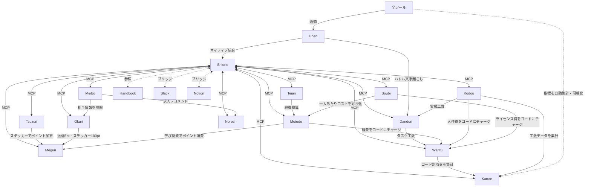

## アーキテクチャ

### GraphQL

Toolkit内の全ツールはGraphQLで連携しています。ツール間のデータの読み書きは統一されたGraphQLスキーマを通じて行われます。

### 公開API

全ツールの公開APIを提供します。顧客が自社のシステムとToolkitを連携したり、データを自動取得したりできます。

### MCP（Model Context Protocol）

各ツールがMCPサーバーを公開しており、[Shiorie](/docs/tools/shiorie)はMCP経由で全ツールを横断します。公開MCPなので、Shiorie以外のAIツールからもToolkitのデータにアクセスできます。

### データエクスポート

全ツールのデータはいつでもエクスポート可能です。Tanden Toolkitをやめる場合も、データは顧客のものです。深い統合によるロックインは体験の良さで選ばれるべきであり、データを人質にして引き留めるものではありません。

## 外部ツール連携

### 二つの戦略

Tanden Toolkitは、チャットとドキュメントについて二つのアプローチを並行して提供します。

| アプローチ | 説明 | 対象 |
|---|---|---|
| **ネイティブ** | [Uneri](/docs/tools/uneri)（チャット）を自社開発し、Shiorieをネイティブ統合する。最も深い体験が得られる | Toolkit体験を最大化したい顧客 |
| **ブリッジ** | 既存のSlack・Notion等にShiorieがMCP経由で接続する。顧客のツールスタックを変えずにToolkitの価値を届ける | 既存ツールを維持したい顧客 |

### なぜ両方必要か

「全部うちで作る」だけでは顧客の選択肢を狭めます。「全部外部ツールに乗る」だけでは統合の深さに限界があります。

- **ネイティブ路線**は体験の上限を引き上げます。Uneriなら会話の文脈からToolkit操作がシームレスに起動し、全イベントがネイティブ通知として届きます
- **ブリッジ路線**は導入の障壁を下げます。「Slackを変えたくない」「Notionに資産がある」という顧客でも、Shiorieボット + MCPで Toolkitの価値を体験できます

顧客は自社の状況に合わせて選べます。ブリッジで始めてネイティブに移行することも、ブリッジのまま使い続けることもできます。

### ブリッジ対応ツール

Shiorieが外部ツールとMCP接続し、Toolkit機能をブリッジします。

| 外部ツール | Shiorieができること | 制約 |
|---|---|---|
| **Slack** | Slackボットとして常駐。Toolkit全操作をコマンド＋自然言語で実行。Tsuzuri・Okuriの自動投稿。通知配信 | Uneriのネイティブ統合と比べると、文脈認識やUI連動に限界がある |
| **Notion** | ドキュメントの読み書き。Toolkit内のデータとNotionページの相互参照。会議メモからDandoriのタスク更新 | Notion側のデータ構造に依存する。Toolkitのスキーマとの完全な整合は保証しない |
| **Google Workspace** | Google Docsの参照、Googleカレンダーとの連携 | 読み取り中心。書き込みは明示的な指示のみ |

### ネイティブ vs ブリッジの体験差

| 機能 | ネイティブ（Uneri） | ブリッジ（Slack） |
|---|---|---|
| Shiorieの文脈認識 | 会話の流れから自動で操作を提案 | コマンドまたはメンションで明示的に起動 |
| Toolkit通知 | 全イベントをネイティブ通知 | Webhook連携。通知粒度の制御に限界がある |
| ojtチャンネル | 入社時に自動生成 | 手動作成 |
| Tsuzuri連携 | 日報投稿がシームレスに反映 | ボット経由で投稿。体験はほぼ同等 |
| ハドル→Dandori | 文字起こしから直接タスク更新 | Slack Huddleの文字起こしをShiorieが解析（精度は若干劣る） |

ブリッジでも**Toolkitの核心的な価値（承認レス運用、データの統合、Karute可視化）は同等に得られます**。差が出るのはコミュニケーション周りの体験の滑らかさです。

## ツール間連携マップ

## ツール間連携一覧

| 起点 | 連携先 | 内容 |
|---|---|---|
| Uneri | Shiorie | ネイティブ統合。チャットからToolkit全操作 |
| Uneri | 全ツール | 全イベントの通知ハブ |
| Shiorie | 全ツール | MCP経由で情報の読み書き |
| Shiorie | ハンドブック | 制度・カルチャー情報を参照 |
| Shiorie | Slack / Notion等 | ブリッジ接続。外部ツール上でToolkit操作 |
| Meibo | Noroshi | スキルや魂のカタチに合う求人をレコメンド |
| Meibo | Okuri | フィードバック送信時に相手情報を参照 |
| Tsuzuri | Meguri | ステッカー付与で自動ポイント加算 |
| Okuri | Meguri | 送信で5pt、ステッカーで100pt自動加算 |
| Teian | Motode | テイアン後に経費精算 |
| Motode | Meguri | 学び投資でポイントを自動消費 |
| Motode | Warifu | 経費をWarifuコードにチャージ |
| Kodou | Warifu | 社内単価 × 時間で人件費をコードにチャージ |
| Dandori | Warifu | タスク工数をコードにチャージ |
| Uneri | Dandori | ハドル文字起こしからWBS自動更新 |
| Kodou | Dandori | 実績工数を反映し遅延予測 |
| Soubi | Warifu | 申請制SaaSのライセンス費をコードにチャージ |
| Soubi | Motode | 一人あたりSaaSコストを可視化 |
| Warifu | Karute | コード別・レーベル別の収支を集計 |
| Kodou | Karute | 工数データを集計・可視化 |
| 全ツール | Karute | 各種指標を自動集計・可視化 |
