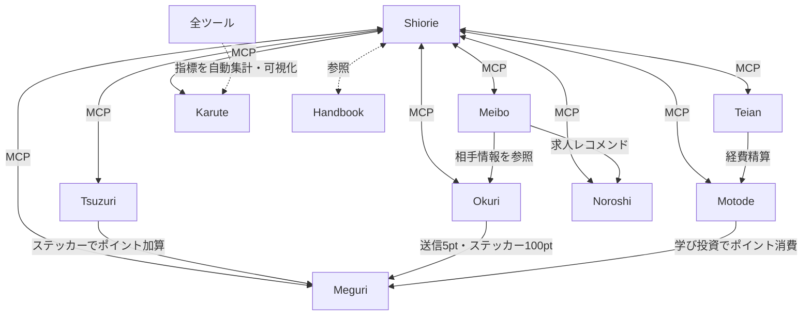

## 連携一覧

| 起点 | 連携先 | 内容 |
|---|---|---|
| Shiorie | 全ツール | MCP経由で情報の読み書き |
| Shiorie | ハンドブック | 制度・カルチャー情報を参照 |
| Meibo | Noroshi | スキルや魂のカタチに合う求人をレコメンド |
| Meibo | Okuri | フィードバック送信時に相手情報を参照 |
| Tsuzuri | Meguri | ステッカー付与で自動ポイント加算 |
| Okuri | Meguri | 送信で5pt、ステッカーで100pt自動加算 |
| Teian | Motode | テイアン後に経費精算 |
| Motode | Meguri | 学び投資でポイントを自動消費 |
| 全ツール | Karute | 各種指標を自動集計・可視化 |
